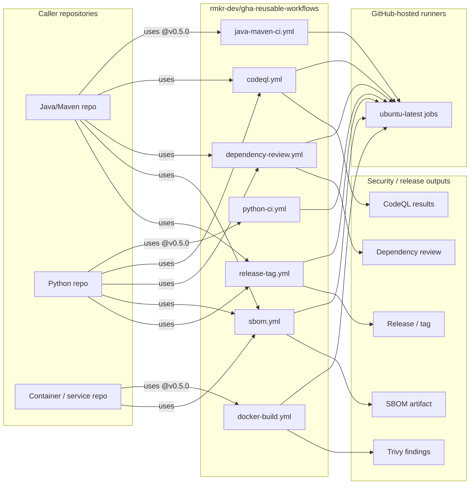

# Architecture diagram

```mermaid
flowchart LR
  subgraph Callers["Caller repositories"]
    JP["Java/Maven repo"]
    PP["Python repo"]
    DP["Container / service repo"]
  end

  subgraph Reusable["rmkr-dev/gha-reusable-workflows"]
    PY["python-ci.yml"]
    JV["java-maven-ci.yml"]
    DK["docker-build.yml"]
    CQ["codeql.yml"]
    DR["dependency-review.yml"]
    SB["sbom.yml"]
    RT["release-tag.yml"]
  end

  subgraph Runners["GitHub-hosted runners"]
    R["ubuntu-latest jobs"]
  end

  subgraph Supply["Security / release outputs"]
    CQout["CodeQL results"]
    DRout["Dependency review"]
    SBout["SBOM artifact"]
    TRout["Trivy findings"]
    RELout["Release / tag"]
  end

  JP -->|uses @v0.5.0| JV
  JP -->|uses| CQ
  JP -->|uses| DR
  JP -->|uses| SB
  JP -->|uses| RT
  PP -->|uses @v0.5.0| PY
  PP -->|uses| CQ
  PP -->|uses| DR
  PP -->|uses| SB
  PP -->|uses| RT
  DP -->|uses @v0.5.0| DK
  DP -->|uses| SB

  PY --> R
  JV --> R
  DK --> R
  CQ --> R
  DR --> R
  SB --> R
  RT --> R

  CQ --> CQout
  DR --> DRout
  SB --> SBout
  DK --> TRout
  RT --> RELout
```

Self-test path (this repository): `ci.yml` → Python / Java / Docker / SBOM reusable
workflows against `samples/*`.

Callers pin `@v0.5.0` (or `@main` while dogfooding).
