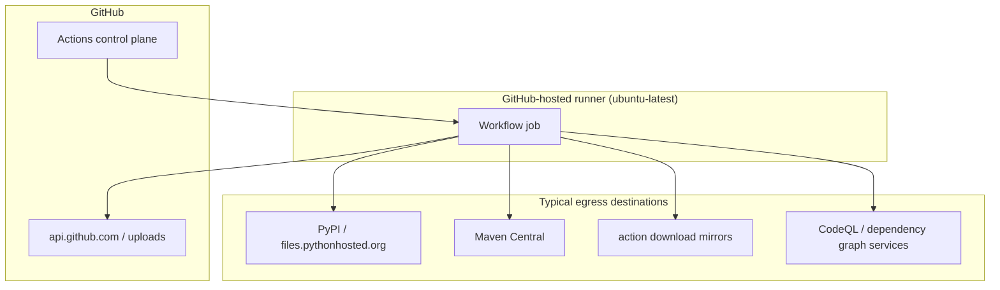

# Network diagram

CI jobs in this design use **GitHub-hosted runners** only. There are no self-hosted runners and no private VPC attachments from this repository.

## Expectations for consumers

| Concern | Guidance |
| --- | --- |
| Runner type | Default `ubuntu-latest` GitHub-hosted; override only if your org requires it |
| Outbound network | Jobs need egress to package registries (PyPI, Maven Central) and GitHub APIs |
| Private registries | Callers must configure auth in **their** workflows/secrets; this repo does not ship registry credentials |
| Inbound | No inbound ports; runners are ephemeral |
| Allowlists | If your org restricts egress, allow PyPI/Maven Central plus GitHub Actions endpoints |
| Secrets | Prefer OIDC / `GITHUB_TOKEN`; avoid long-lived PATs in reusable workflow defaults |

## What this repo does not do

- Does not open firewall holes on caller infrastructure.
- Does not require VPN or private DNS.
- Does not store or log consumer credentials.
